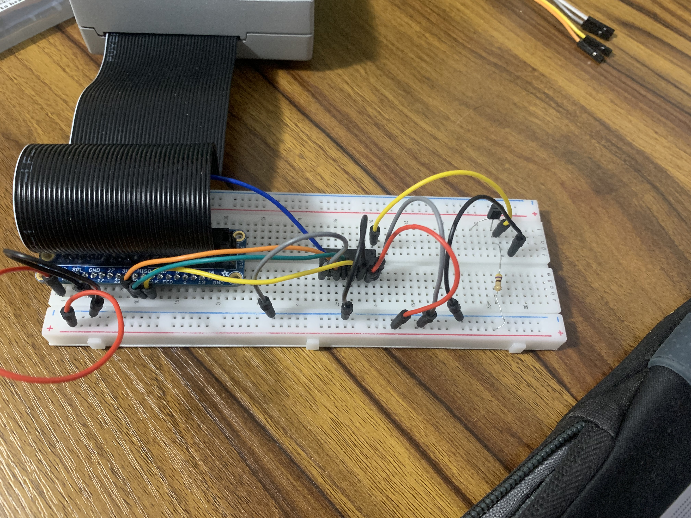

# HW8
## Overview:
- The goal is to first build the circuit and running the sample code to verify the value of the
  LM335Z circuit and give the user a reasonable presentation.
- Then design some situation or purpose that uses the reading of temperature to impact
  something else happening.
- I decided to enhance the assignment by creating a temperature indicator system. 
- The system allows the user to set a lower temperature bound and an upper temperature
  bound by using two potentiometers. The ranges for the two bounds are 0 - 100 degrees Celsius.
- I then added three LEDs to my circuit/system. Based on the current, lower bound, and upper bound
  temperatures the appropriate LED will illuminate. If the current temp is less than the lower bound
  the Blue LED will illuminate. If the current temp is greater than the upper bound
  the Red LED will illuminate. If the current temp is within the bounds the Green LED will illuminate.

## Task A:
- Build the proper circuit to receive signals from the LM335Z and
  observe the reading provided using the sample C code.
  
- File: [TaskA_output.png](TaskA_output.png) 

## Task B & C:
- Results for Task B & C can be seen below
- Video link: [video](https://www.dropbox.com/scl/fi/h6ms040245zcvzgf4tlu0/HW8_result.mov?rlkey=c1kb6aeqw9msc4cwp8l9fkghh&st=lwufuocx&dl=0)
